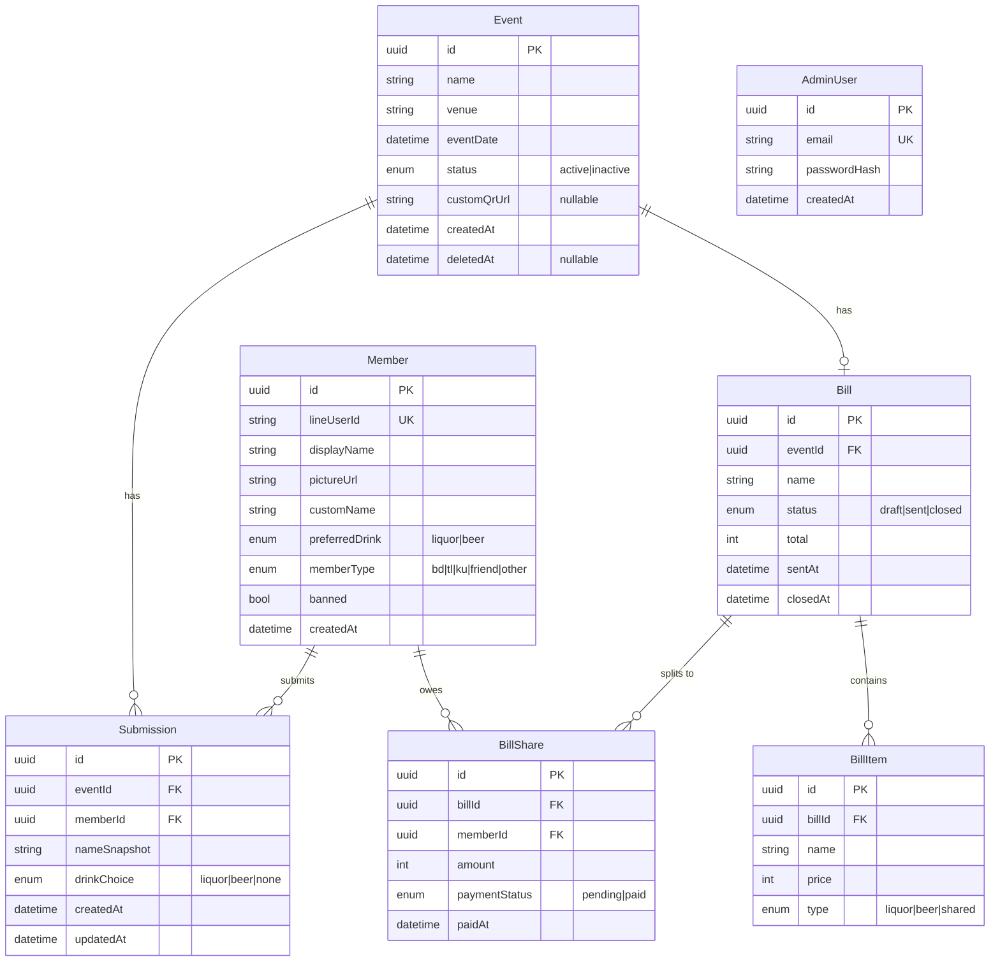

# PRD — MaoLeaw (เมาแล้ว) Event & Bill Splitter

> **Codename:** MaoLeaw
> **Author:** chanakarn.s
> **Last updated:** 2026-05-23
> **Status:** Draft v1.0

---

## 1. Feature Overview & KPIs

### 1.1 Problem Statement
กลุ่มเพื่อน/ก๊วนสังสรรค์มักประสบปัญหาในการ:
- **เก็บข้อมูลผู้เข้าร่วมงาน** ว่าใครจะมา ใครกินอะไร (เหล้า/เบียร์/ไม่กินแอล)
- **หารค่าใช้จ่าย** ที่ไม่แฟร์ เพราะคนที่ไม่กินแอลต้องช่วยจ่ายค่าเหล้า/เบียร์ด้วย
- **ติดตามบิล** หลังงานเลิก ใครต้องโอนเท่าไหร่ ไม่มีระบบกลาง

### 1.2 Solution
ระบบ 2 ส่วน:
1. **LIFF Web** (ฝั่ง user) — ติดกับ Rich Menu ของ LINE OA สำหรับ register, ดู events, join events, ดู bill
2. **Admin Web** (ฝั่ง admin) — สำหรับสร้าง/แก้ไข event, สร้าง bill, จัดการ member

### 1.3 KPIs / Success Metrics
| Metric | Target |
|---|---|
| Active user (LIFF) | 80%+ ของก๊วน register ภายใน 2 สัปดาห์ |
| Event submission rate | ≥ 90% ของผู้เข้าร่วมจริงกด "เข้าร่วม" ก่อนงาน |
| Bill payment cycle | ปิดบิลภายใน 7 วันหลัง event |
| LIFF load time (4G) | < 2.5s |
| Free-tier cost | $0/เดือน (ภายในขีดจำกัด free quota) |

### 1.4 Out of Scope (Phase 1)
- ระบบ verify การจ่ายเงินจริง (ยึดความซื่อสัตย์, admin mark paid เอง — ดูใน Phase 2)
- Multi-tenant (รองรับกลุ่มเดียวก่อน)
- Mobile native app
- Push notification ไปยัง browser (ใช้ LINE Push แทน)

---

## 2. Target Platforms & User Roles

### 2.1 Platforms

| Component | Platform | Framework | Hosting |
|---|---|---|---|
| LIFF Web | LINE LIFF (mobile-first WebView) | Next.js 16 (App Router) | Vercel (free) |
| Admin Web | Desktop-first Responsive Web | Next.js 16 | Vercel (free) |
| API | REST (JSON) | NestJS 11 | Render (free, มี cold start) |
| Database | PostgreSQL 16 | Prisma ORM | Supabase (free, 500MB) |
| Notification | LINE Messaging API (Push) | — | LINE OA (free 500 msg/เดือน) |

> **Note on cold start:** Render free tier sleep หลัง inactive 15 นาที → request แรกใช้ ~50s. แนะนำใช้ cron-job.org (ฟรี) ping `/health` ทุก 10 นาทีในช่วงเวลาใช้งาน (เช่น 17:00–02:00).

> **Note on Supabase pause:** Supabase pause project ถ้า inactive 1 อาทิตย์. แก้โดย cron ping ทุก 6 วัน หรือ admin ใช้งานสม่ำเสมอ.

### 2.2 User Roles

| Role | Auth | Access |
|---|---|---|
| **Guest (LIFF)** | ยังไม่ register | เฉพาะหน้า Register |
| **Member (LIFF)** | LINE Login + registered | ดู events, join, edit profile, ดู my events, ดู bill |
| **Admin (Web)** | Email/Password (JWT) | CRUD event, bill, member; ดู dashboard ทุก event |

---

## 3. User Stories & Functional Workflows

### 3.1 LIFF Web — User Flows

#### F-1: Login & Register (First-time)
```
User กด Rich Menu → เปิด LIFF
  ↓
LIFF auto-login (liff.login) → ได้ lineUserId, displayName, pictureUrl
  ↓
Backend: ค้น member by lineUserId
  ├─ พบ → ไปหน้า Main (F-2)
  └─ ไม่พบ → ไปหน้า Register
       ↓
       Register Form:
         • ชื่อ (text, default = LINE displayName, แก้ไขได้)
         • เครื่องดื่มที่ชอบ (dropdown: เหล้า / เบียร์) — required
         • ประเภท (dropdown: เด็ก BD / เด็ก TL / เด็ก KU / เพื่อนอีสเหล้า / อื่นๆ) — required
       ↓
       กด "ลงทะเบียน" → POST /members → กลับหน้า Main
```

**Edge cases:**
- ถ้า user ปฏิเสธสิทธิ์ LINE Profile → แสดง error "กรุณาอนุญาตเพื่อใช้งาน" + ปุ่ม retry
- ถ้าเปิดนอก LINE app (เปิด LIFF URL ตรงๆ) → redirect ไปยัง LINE
- displayName/pictureUrl จะถูก **sync จาก LINE ทุกครั้งที่ login** (เผื่อ user เปลี่ยนรูป/ชื่อใน LINE)

#### F-2: Main Page (Active Events)
```
แสดง list ของ events ที่:
  - status = 'active'
  - eventDate ≥ today - 1 day (กันเหลื่อมเวลา timezone)

แต่ละ item แสดง:
  • ชื่อ event
  • วันที่จัด (format: 23 พ.ค. 2026 - 19:00)
  • ร้านที่ไป
  • สถานะ badge (กำลังจะมาถึง / วันนี้ / ผ่านมาแล้ว — แต่ยังอยู่ใน list)

Header: รูปโปรไฟล์ LINE + ชื่อ (จาก liff.getProfile cached)
Bottom Tab: Main | My Events | Profile
```

#### F-3: Event Detail — Pre-event (eventDate > now)
```
หน้านี้เป็น "Dashboard ผู้เข้าร่วม":
  • ข้อมูล event (ชื่อ, วันที่, ร้าน, จำนวนคนรวม)
  • Stats card:
      - Total attendees: 12 คน
      - Pie/Bar chart: เหล้า X% / เบียร์ Y% / ไม่กินแอล Z%
  • List ผู้เข้าร่วม:
      - รูปโปรไฟล์ + ชื่อ + เครื่องดื่มที่จะกิน
      - (ถ้าเป็นตัวเองมี badge "คุณ")
  • ปุ่ม [เข้าร่วมงาน] (sticky bottom)
      ├─ ยังไม่เคย submit → label "เข้าร่วมงาน"
      └─ submit แล้ว → label "แก้ไขการเข้าร่วม"

กด ปุ่ม → เปิด Dialog (Modal):
  Form:
    • ชื่อ (default = member.displayName, แก้ไขได้)
    • เครื่องดื่มที่จะกิน (radio: เหล้า / เบียร์ / ไม่กินแอล)
      └─ default = member.preferredDrink
    • ☐ กินมิกเซอร์ด้วย (checkbox, แสดงเฉพาะเมื่อเลือก 'ไม่กินแอล')
      └─ default = false
      └─ ติ๊กแล้ว → ร่วมหารค่ามิกเซอร์ (โซดา/น้ำแข็ง/น้ำผลไม้) แต่ยังไม่จ่ายค่าเหล้า/เบียร์
    • [Submit] (disabled จนกว่าทุก field จะกรอกครบ)

  Submit → POST /events/:id/submissions → toast "บันทึกแล้ว" + ปิด dialog + refresh stats
```

**Edge cases:**
- ถ้า admin ลบ event ระหว่าง user เปิด dialog → submit returns 404 → show toast + redirect Main
- Optimistic UI: update list ทันทีก่อน server confirm

#### F-4: Event Detail — Post-event (eventDate < now AND bill exists)
```
แสดงหน้า "บิลของคุณ":
  • ข้อมูล event (header)
  • ยอดที่ต้องจ่าย: ฿XXX
  • Breakdown:
      - ค่าอาหาร/หารทุกคน: ฿XX
      - ค่าเครื่องดื่ม (เหล้า/เบียร์): ฿XX
      - ค่ามิกเซอร์: ฿XX (แสดงเฉพาะคนที่ร่วมหาร)
  • รูป QR PromptPay (generate dynamic with amount):
      - ถ้า event มี customQrUrl → แสดงรูป QR ที่ admin upload (ตาม Hybrid mode)
      - ถ้าไม่มี → generate QR จาก PROMPTPAY_ID + amount โดย promptpay-qr (client-side, ไม่กิน storage)
  • ปุ่ม "บันทึกรูป" (download QR)
  • Status: [⏳ รอชำระ] หรือ [✅ ชำระแล้ว]
```

**Edge cases:**
- ถ้า user submit แต่ admin ยังไม่ปิดบิล → แสดง "รอ admin คิดบิล"
- ถ้า user ไม่ได้ submit เข้าร่วม → แสดง "คุณไม่ได้เข้าร่วมงานนี้"

#### F-5: My Events
```
List events ที่ user เคย submit เข้าร่วม:
  • Sort: วันที่จัด (DESC)
  • Filter built-in (chip): ทั้งหมด / กำลังจะมา / ผ่านแล้ว
  • แต่ละ item เหมือน F-2 แต่มี badge "✓ เข้าร่วม"
  • Tap → ไป F-3 หรือ F-4 ตามเงื่อนไขเวลา
```

#### F-6: Edit Profile
```
ฟอร์ม:
  • ชื่อ (text)
  • เครื่องดื่มที่ชอบ (dropdown: เหล้า / เบียร์)
  • ประเภท (dropdown: เด็ก BD / เด็ก TL / เด็ก KU / เพื่อนอีสเหล้า / อื่นๆ)
  • [บันทึก]

Note: รูปและ LINE display name แก้ไขใน LINE app เอง (อ่านอย่างเดียว)
```

---

### 3.2 Admin Web — Admin Flows

#### A-1: Login
```
Email + Password → POST /auth/admin/login → JWT (httpOnly cookie, 7d)
Middleware ใน Next.js ตรวจ cookie ทุก route ยกเว้น /login
```

**Initial admin seed:** SQL migration หรือ CLI command `npm run seed:admin` (รัน manual ครั้งแรก).

#### A-2: Sidebar Navigation
```
┌─ Logo "MaoLeaw Admin"
├─ 📅 Events
├─ 💵 Bills
├─ 👥 Members
└─ ⚙️  Settings (logout, change password)
```

#### A-3: Events Table
```
Columns: Name | Date | Venue | Status | Attendees | Actions
Filter: Status (All / Active / Inactive), Date range
Search: by name/venue
Actions per row:
  [👁 View]  → ดู attendee list
  [✏️ Edit]  → ไปหน้า Create/Edit (A-4)
  [🗑 Delete] → confirm dialog → soft delete (set deletedAt)
  [💵 Create Bill] → ไปหน้า Bill create พร้อม pre-select event นี้

Top right:
  [+ Create Event] → A-4
```

#### A-4: Event Create/Edit
```
Form:
  • ชื่องาน (text, required, max 100)
  • ร้าน (text, required, max 200)
  • วันเวลาที่จัด (datetime-picker, required)
  • Status (dropdown: Active / Inactive, default Active)
  • [Save] [Cancel]
```

#### A-5: Bills Table
```
Columns: Bill Name | Event | Created Date | Total | Status | Actions
Status: Draft / Sent / Closed
Actions:
  [👁 View Detail]
  [✏️ Edit]  (อนุญาตเฉพาะ Draft)
  [📨 Send to Members] → trigger LINE Push (เปลี่ยน status → Sent)
  [🔒 Close]  → lock submissions (เปลี่ยน status → Closed)
  [🗑 Delete] (soft delete)

Top: [+ Create Bill]
```

#### A-6: Bill Create/Edit
```
Form:
  • ชื่อบิล (text, required)
  • Event (dropdown — load events ที่ status active หรือผ่านมาแล้วและยังไม่มี bill)
  • รายการ (dynamic list, มี [+ เพิ่มรายการ]):
      Row:
        - ชื่อ (text)
        - ราคา (number, ≥ 0)
        - ประเภท (dropdown: เหล้า / เบียร์ / มิกเซอร์ / หารทุกคน)
        - [🗑]
  • Summary (auto-calc):
      Total: ฿XXX
      Liquor items: ฿XX (หารคนเลือกเหล้า N คน → ฿YY/คน)
      Beer items: ฿XX (หารคนเลือกเบียร์ M คน → ฿YY/คน)
      Mixer items: ฿XX (หารคนกินเหล้า + คนไม่กินแอลที่ติ๊ก 'กินมิกเซอร์ด้วย' = P คน → ฿YY/คน)
      Shared items: ฿XX (หารทุกคน K คน → ฿YY/คน)
  • Preview ตารางคิดเงินรายคน
  • [Save Draft] [Save & Send]
```

#### A-7: Members Table
```
Columns: Picture | Name | LINE Display Name | Type | Preferred Drink | Registered Date | Total Events | Actions
Search: by name
Filter: by type (เด็ก BD / TL / KU / etc.)
Actions: [👁 View] (ดู events ที่เข้าร่วม) | [🚫 Ban] (soft, ห้าม login)

> ไม่มี Create Member — register เฉพาะผ่าน LIFF
```

---

### 3.3 Bill Calculation Logic (Critical)

```
สำหรับ bill ที่ผูกกับ event E:
  attendees = list ของ submission ใน event E (after closed)

  สำหรับแต่ละ item i ใน bill:
    if i.type == 'shared':
      eligibleCount = len(attendees)
      perPerson_i = i.price / eligibleCount
      → add perPerson_i to ทุกคน

    elif i.type == 'liquor':
      eligible = attendees.filter(drink == 'liquor')
      if len(eligible) == 0: skip (warning to admin)
      perPerson_i = i.price / len(eligible)
      → add perPerson_i ให้คนเหล่านั้น

    elif i.type == 'beer':
      eligible = attendees.filter(drink == 'beer')
      if len(eligible) == 0: skip (warning to admin)
      perPerson_i = i.price / len(eligible)
      → add perPerson_i ให้คนเหล่านั้น

    elif i.type == 'mixer':
      eligible = attendees.filter(drink in ['liquor', 'beer'] OR sharesMixer == true)
      if len(eligible) == 0: skip (warning to admin)
      perPerson_i = i.price / len(eligible)
      → add perPerson_i ให้คนเหล่านั้น

  → คนที่เลือก 'ไม่กินแอล' จะ**ไม่ได้รับ**ค่าเหล้า/เบียร์เลย จ่ายเฉพาะ shared items
    (+ mixer items เฉพาะกรณีที่ติ๊ก 'กินมิกเซอร์ด้วย' ตอน submit)

ปัดเศษ: round up ทศนิยม → ส่วนต่างเป็น "tip" ที่ admin/เจ้าภาพรับไป
```

---

### 3.4 Notification Flow (LINE Push)

```
Admin กด "Send Bill" → backend:
  1. คำนวณยอดต่อคน
  2. สำหรับแต่ละ attendee:
       POST https://api.line.me/v2/bot/message/push
       Body: Flex Message
         {
           header: "บิลพร้อมแล้ว 💸",
           body: {
             event: "งานเลี้ยงรุ่น 35",
             amount: "฿450",
             due: "ภายใน 7 วัน"
           },
           footer: [
             button(action=uri, label="ดูบิล + QR", uri=`liff://app/{liffId}?to=/bills/{billId}`)
           ]
         }
  3. Log push result (success/fail) → admin เห็นในหน้า bill detail
```

**Quota:** LINE OA free = 500 msg/เดือน → พอใช้สำหรับกลุ่ม ~50 คน × 10 events/เดือน.

---

## 4. Data Dictionary & Schema

### 4.1 ER Diagram (Mermaid)



### 4.2 Key Field Validations

| Field | Type | Rules |
|---|---|---|
| `Member.customName` | string | 1–50 chars, trim, ห้าม empty |
| `Member.preferredDrink` | enum | `liquor` หรือ `beer` (register หน้ามี 2 ตัว) |
| `Submission.drinkChoice` | enum | `liquor` / `beer` / `none` (มีตัวเลือกที่ 3 เฉพาะ submission) |
| `Event.eventDate` | datetime | future หรือ past ก็ได้ (แก้ย้อนหลังได้) |
| `BillItem.price` | int (THB) | ≥ 0, เก็บเป็น integer (บาท ไม่มีสตางค์) |
| `AdminUser.password` | string | bcrypt hash, plaintext min 10 chars |

### 4.3 UI Element Inventory (จะ map ในขั้นตอน UX/UI)

| Screen | Key Components |
|---|---|
| LIFF Register | Avatar, Input, Select×2, Button |
| LIFF Main | Card list, Pull-to-refresh, Tab bar |
| LIFF Event Detail | Stat cards, Chart, Avatar list, Sticky CTA, Bottom Sheet |
| LIFF Bill View | Amount header, QR image, Status badge, Download btn |
| Admin Events Table | DataTable (TanStack), Action menu, Modal confirm |
| Admin Bill Form | Repeater rows, Live summary, Preview drawer |

---

## 5. Edge Cases & Exception Handling

### 5.1 LIFF Edge Cases

| Scenario | Behavior |
|---|---|
| User เปิด LIFF ผ่าน external browser (ไม่ใช่ LINE) | แสดงหน้า "กรุณาเปิดผ่าน LINE" + QR ของ LINE OA |
| LINE Profile API ล่ม | Fallback: ใช้ค่าใน DB (ถ้ามี) หรือ retry button |
| Network offline | Toast "ไม่มี internet" + cache last response สำหรับ Main page |
| User ถูก ban (`banned = true`) | Login OK แต่ทุก API คืน 403 + แสดงหน้า "บัญชีถูกระงับ" |
| Event ถูก delete ระหว่าง user อยู่ในหน้า | API คืน 404 → toast + redirect Main |
| Submit เครื่องดื่มหลังบิลปิด (`status = closed`) | API คืน 409 → toast "ปิดบิลแล้ว แก้ไม่ได้" |
| Concurrent submission (user open 2 tab) | Use `updatedAt` optimistic lock → second submit เตือน "มีการอัพเดทใหม่" |

### 5.2 Admin Edge Cases

| Scenario | Behavior |
|---|---|
| Admin สร้าง bill โดยที่ event มี attendee = 0 | Block + warning "ไม่มีผู้เข้าร่วม" |
| Admin สร้าง item เหล้า แต่ไม่มีใครเลือกเหล้า | Allow แต่ flag warning + เงินก้อนนี้ admin รับผิดชอบเอง (หรือ skip — admin เลือก) |
| Admin ลบ event ที่มี bill อยู่ | Block + แจ้ง "ต้องลบ bill ก่อน" |
| 2 admin edit bill พร้อมกัน | Optimistic lock via `updatedAt`, last-write loses → reload prompt |
| LINE push quota หมด (500/เดือน) | API คืน error → admin เห็น "quota หมด, ส่ง manual" + ปุ่ม copy ข้อความ |
| ลบ admin คนเดียวในระบบ | Block (ต้องมี ≥ 1 admin) |

### 5.3 Data Integrity

- **Cascade delete:** Soft delete event → bill ที่ link ยังอยู่ แต่ flag warning
- **Hard delete member:** ห้าม (เพราะกระทบ submission history) → ใช้ ban แทน
- **Money rounding:** เก็บเป็น integer (THB) ตลอด → ป้องกัน floating point error

---

## 6. Compliance & Non-Functional Requirements

### 6.1 Privacy & PDPA

| Item | Handling |
|---|---|
| LINE userId, displayName, pictureUrl | จัดเก็บใน DB, ใช้เฉพาะใน app, ไม่แชร์บุคคลที่สาม |
| Consent | แสดง consent text ในหน้า Register: "ระบบจะเก็บข้อมูล LINE profile และข้อมูลการเข้าร่วมงาน" |
| Data deletion request | Admin manual delete (ใน Phase 2 จะมี self-service) |
| HTTPS | บังคับทุก endpoint (Vercel/Render auto) |
| Secrets | เก็บใน `.env` + Vercel env vars, ไม่ commit |

### 6.2 Security

- JWT secret rotate ทุก 90 วัน (manual)
- bcrypt rounds = 12 สำหรับ admin password
- Rate limit: 10 req/min ต่อ IP สำหรับ login endpoints
- Input sanitization: NestJS class-validator + Prisma escape
- LIFF: verify `idToken` server-side ทุก request (ไม่เชื่อ client-only)
- CORS: whitelist เฉพาะ domain ของ LIFF + Admin

### 6.3 Performance

| Metric | Target |
|---|---|
| LIFF first paint | < 2.5s on 4G |
| API p95 latency (warm) | < 500ms |
| API p95 latency (cold start) | < 60s (Render free) — mitigated by cron ping |
| DB connection pool | 5 connections (Supabase free limit) |
| Bundle size (LIFF) | < 200KB gzipped |

### 6.4 Cost Constraints (Free Tier)

| Service | Free Limit | Projected Usage |
|---|---|---|
| Vercel | 100GB bandwidth/mo | < 5GB |
| Render | 750 hr/mo, sleep after 15min | OK with cron ping |
| Supabase | 500MB DB, 1GB storage, pause after 7d inactive | DB ~20MB est., no storage upload (ใช้ Hybrid QR — fixed by default) |
| LINE OA | 500 push msg/mo | ~50 msg/event × ~10 events = 500 ✓ |
| LIFF | ฟรีไม่จำกัด | — |

---

## 7. Recommended Additional Flows (BA Suggestions)

> นอกเหนือจาก scope ที่คุณคิดมา ผมแนะนำเพิ่มเพื่อให้ระบบ practical:

### 7.1 Must-have (Phase 1)
1. **Bill confirmation by user** — ใน LIFF bill view มีปุ่ม "ฉันโอนแล้ว 📸" + upload slip (optional, base64 ไม่ต้องเก็บ) → mark `paid` (admin ตรวจอีกที). แก้ปัญหา admin ตามเงินยุ่งยาก.
2. **Admin can mark paid** — ในหน้า bill detail (admin) มี checkbox ข้างชื่อแต่ละคน → toggle paid/pending. + นับ "เก็บเงินครบแล้ว X/Y คน"
3. **My total debt summary** — ใน LIFF profile แสดง "ยอดค้างจ่ายรวม ฿XXX" ของทุก bill ที่ pending → กระตุ้นจ่าย
4. **Empty states & loading skeletons** — สำคัญสำหรับ LIFF UX

### 7.2 Nice-to-have (Phase 2)
5. **Event RSVP cap** — admin จำกัดจำนวนคนเข้าร่วมได้ (เช่นโต๊ะมีจำกัด)
6. **Recurring event template** — duplicate event เก่า (สำหรับงานประจำ)
7. **Export bill เป็น CSV/รูปภาพ** — admin ส่งสรุปให้กลุ่ม LINE
8. **Group chat integration** — admin pin announcement ใน LINE group ผ่าน Messaging API
9. **Member statistics** — "ไอ้คนนี้กินเหล้าไป 47 ครั้งในปีนี้ 🥃" (Fun & retention)
10. **Tip jar / round-up** — เผื่อ admin ขอ tip เล็กน้อยจากเศษเงิน

### 7.3 Operational
11. **Admin notification** — ส่งสรุปยอดหลัง close bill เข้า LINE Notify ของ admin
12. **Cron ping** — cron-job.org (ฟรี) → ping `/health` ทุก 10 นาทีในช่วง 17:00–02:00 (Thailand time) → กัน cold start
13. **DB backup** — Supabase free มี daily backup (รักษา 1 วัน) → admin export manual ทุกอาทิตย์

---

## 8. Tech Decisions Summary

| Decision | Choice | Rationale |
|---|---|---|
| Frontend | Next.js 16 App Router | SSR/ISR, deploy ฟรีบน Vercel, ใช้ component ร่วมกันได้ระหว่าง LIFF + Admin |
| Backend | NestJS 11 | ตาม user request, modular, มี built-in DI/validation |
| ORM | Prisma | type-safe, migration ดี, รองรับ Supabase |
| Auth (LIFF) | LINE Login (idToken verify) | Native ของ LIFF |
| Auth (Admin) | JWT (Email/Password) | แยกจาก LINE ตาม user choice |
| QR Payment | Hybrid: env-default + per-event override URL | ประหยัด storage + flexible |
| LINE Profile | Cache `pictureUrl` + `displayName` in DB | offline-friendly, sync ทุก login |
| Bill split (ไม่กินแอล) | จ่ายเฉพาะ shared items (+ mixer ถ้าติ๊ก flag `sharesMixer`) | Fair, ตรง intent + รองรับเคสกินโซดา/น้ำผลไม้ |
| Notification | LINE Push (Messaging API) | Native UX, ฟรี 500/เดือน |
| Edit submission | แก้ได้จนกว่า admin จะปิดบิล | Flexible |
| Hosting | Vercel + Render + Supabase | ฟรี 100% (มี cold-start trade-off) |

---

## 9. Open Questions / To Confirm

1. **PromptPay ID** — ต้องการเบอร์/เลข ID ของใครเป็น default? (เก็บใน .env)
2. **LINE OA channel** — มี existing channel อยู่แล้วหรือสร้างใหม่? (ต้องใช้ Messaging API + LIFF channel)
3. **Admin seed** — รายชื่อ admin ตัวแรก (email)?
4. **Member type label** — "เด็ก BD / TL / KU" เป็นชื่อเฉพาะกลุ่ม → อยากให้ admin แก้ list เองได้มั้ย (configurable enum) หรือ hardcode?
5. **Timezone** — ระบบใช้ Asia/Bangkok (UTC+7) ทั้งหมดใช่มั้ย?

---

## 10. Next Steps

1. ✅ **PRD approval** (this doc)
2. 🔜 **SA blueprint** — Database schema (Prisma), API contract (OpenAPI), folder structure → ใช้ `/sa` skill
3. 🔜 **UX/UI design** — Wireframes + Design system → ใช้ `/uxui` skill
4. 🔜 **Dev** — Scaffold Next.js + NestJS + Prisma → ใช้ `/dev` skill
5. 🔜 **QA** — Test cases + e2e → ใช้ `/qa` skill
6. 🔜 **DevOps** — CI/CD + cron ping setup → ใช้ `/devops` skill

---

**End of PRD v1.0**
