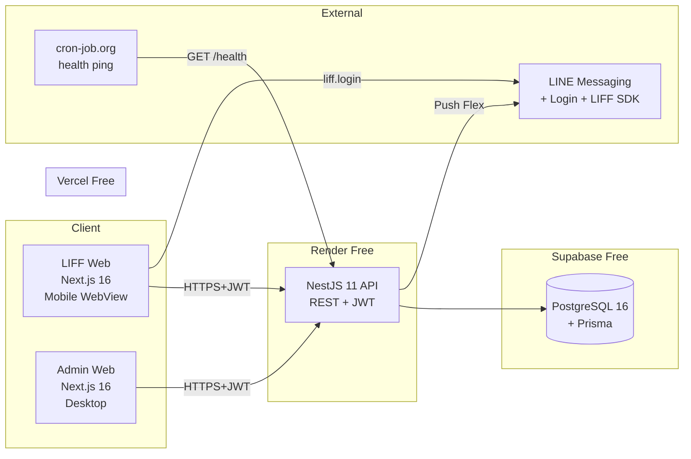
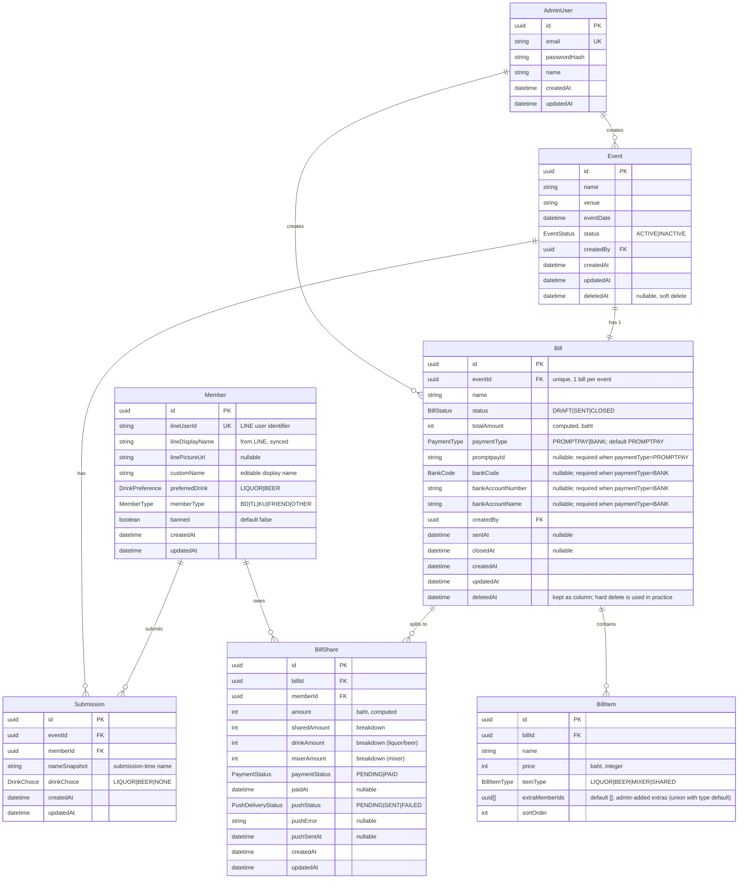
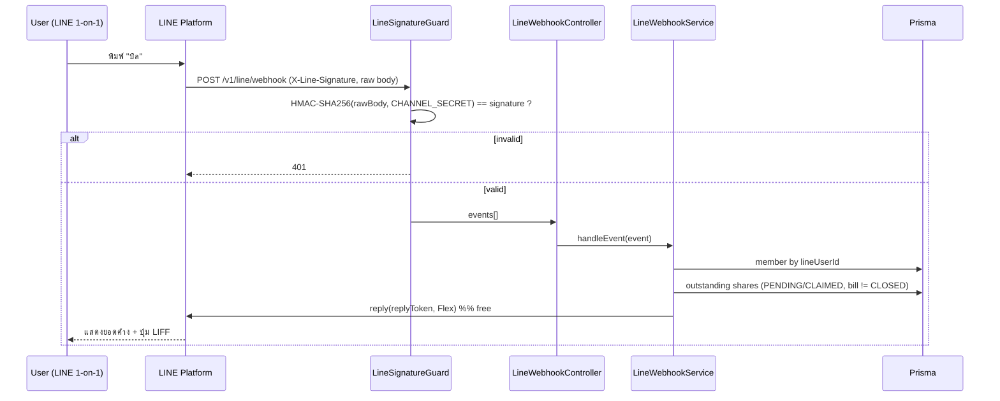

# SA Blueprint — MaoLeaw

> **Source PRD:** `docs/PRD.md` v1.0
> **Last updated:** 2026-05-23
> **Status:** v1.0

---

## 0. Architecture Overview

### 0.1 System Topology



### 0.2 Repo Structure (Turborepo monorepo)

```
maoleaw/
├── apps/
│   ├── liff/              Next.js 16 — LIFF user app
│   ├── admin/             Next.js 16 — Admin dashboard
│   └── api/               NestJS 11 — REST API
├── packages/
│   ├── shared/            Shared TypeScript types, Zod schemas, constants
│   ├── db/                Prisma schema, client, migrations
│   ├── ui/                Shared shadcn/ui components (admin uses heavier set)
│   └── eslint-config/     Shared lint rules
├── turbo.json
├── package.json           pnpm workspaces
└── pnpm-lock.yaml
```

**Build pipeline (turbo.json):**
- `dev` — run all apps in parallel
- `build` — `db#generate` → `shared#build` → apps build
- `lint`, `type-check`, `test` — per-package

---

## 1. ER Diagram



### 1.1 Relationship Cardinality

| Relation | Type | Notes |
|---|---|---|
| Member → Submission | 1:N | 1 submission per (member, event) — enforced by unique constraint |
| Event → Submission | 1:N | many members per event |
| Event → Bill | 1:0..1 | each event has at most one bill |
| Bill → BillItem | 1:N | dynamic line items |
| Bill → BillShare | 1:N | one share row per attendee |
| Member → BillShare | 1:N | a member can owe across multiple bills |

---

## 2. Database Schema Definition

### 2.1 Enums

```prisma
enum DrinkPreference { LIQUOR  BEER }
enum DrinkChoice     { LIQUOR  BEER  NONE }
enum MemberType      { BD  TL  KU  FRIEND  OTHER }
enum EventStatus     { ACTIVE  INACTIVE }
enum BillStatus      { DRAFT  SENT  CLOSED }
enum BillItemType    { LIQUOR  BEER  MIXER  SHARED }
enum PaymentStatus   { PENDING  PAID }
enum PushDeliveryStatus { PENDING  SENT  FAILED }
enum PaymentType     { PROMPTPAY  BANK }
enum BankCode        { BBL  KBANK  KTB  SCB  BAY  TTB  GSB  BAAC  GHB  UOB  CIMB  LHB  TISCO  KKP }
```

### 2.2 `AdminUser`

| Column | Type | Constraints | Description |
|---|---|---|---|
| id | UUID | PK, default `gen_random_uuid()` | |
| email | VARCHAR(255) | UNIQUE, NOT NULL, lowercase | Login email |
| passwordHash | VARCHAR(255) | NOT NULL | bcrypt cost 12 |
| name | VARCHAR(100) | NOT NULL | Display name |
| createdAt | TIMESTAMPTZ | NOT NULL, default `now()` | |
| updatedAt | TIMESTAMPTZ | NOT NULL | auto via Prisma `@updatedAt` |

**Indexes:** unique on `email`

### 2.3 `Member`

| Column | Type | Constraints | Description |
|---|---|---|---|
| id | UUID | PK | |
| lineUserId | VARCHAR(100) | UNIQUE, NOT NULL | from LINE `userId` |
| lineDisplayName | VARCHAR(100) | NOT NULL | synced each login |
| linePictureUrl | TEXT | NULLABLE | LINE profile image URL |
| customName | VARCHAR(50) | NOT NULL | editable name (1–50 chars) |
| preferredDrink | DrinkPreference | NOT NULL | LIQUOR/BEER |
| memberType | MemberType | NOT NULL | BD/TL/KU/FRIEND/OTHER |
| banned | BOOLEAN | NOT NULL, default false | soft ban |
| createdAt | TIMESTAMPTZ | NOT NULL | |
| updatedAt | TIMESTAMPTZ | NOT NULL | |

**Indexes:**
- unique on `lineUserId`
- index on `banned` (for filtering)

### 2.4 `Event`

| Column | Type | Constraints | Description |
|---|---|---|---|
| id | UUID | PK | |
| name | VARCHAR(100) | NOT NULL | |
| venue | VARCHAR(200) | NOT NULL | |
| eventDate | TIMESTAMPTZ | NOT NULL | when the party happens |
| status | EventStatus | NOT NULL, default ACTIVE | |
| createdBy | UUID | FK → AdminUser.id, NOT NULL | |
| createdAt | TIMESTAMPTZ | NOT NULL | |
| updatedAt | TIMESTAMPTZ | NOT NULL | |
| deletedAt | TIMESTAMPTZ | NULLABLE | soft delete |

**Indexes:**
- `(status, deletedAt, eventDate)` composite — for main listing
- `eventDate DESC` for sorting

### 2.5 `Submission`

| Column | Type | Constraints | Description |
|---|---|---|---|
| id | UUID | PK | |
| eventId | UUID | FK → Event.id, CASCADE on delete | |
| memberId | UUID | FK → Member.id, RESTRICT | |
| nameSnapshot | VARCHAR(50) | NOT NULL | name at submit time |
| drinkChoice | DrinkChoice | NOT NULL | LIQUOR/BEER/NONE |
| createdAt | TIMESTAMPTZ | NOT NULL | |
| updatedAt | TIMESTAMPTZ | NOT NULL | optimistic lock |

**Indexes:**
- UNIQUE `(eventId, memberId)` — 1 submission per member per event
- `eventId` index — for listing attendees

### 2.6 `Bill`

| Column | Type | Constraints | Description |
|---|---|---|---|
| id | UUID | PK | |
| eventId | UUID | FK → Event.id, UNIQUE, RESTRICT | 1 bill per event |
| name | VARCHAR(100) | NOT NULL | |
| status | BillStatus | NOT NULL, default DRAFT | |
| totalAmount | INTEGER | NOT NULL, default 0 | sum of items, baht |
| paymentType | PaymentType | NOT NULL, default PROMPTPAY | which payment channel applies to this bill |
| promptpayId | VARCHAR(15) | NULLABLE | 10–15 digits; required (non-null) when paymentType=PROMPTPAY |
| bankCode | BankCode | NULLABLE | required when paymentType=BANK |
| bankAccountNumber | VARCHAR(30) | NULLABLE | required when paymentType=BANK |
| bankAccountName | VARCHAR(100) | NULLABLE | required when paymentType=BANK |
| createdBy | UUID | FK → AdminUser.id | |
| sentAt | TIMESTAMPTZ | NULLABLE | when admin pressed Send |
| closedAt | TIMESTAMPTZ | NULLABLE | when admin closed (locks edits) |
| createdAt | TIMESTAMPTZ | NOT NULL | |
| updatedAt | TIMESTAMPTZ | NOT NULL | |
| deletedAt | TIMESTAMPTZ | NULLABLE | column kept for backward compat; hard-delete is used in practice (CASCADE removes items/shares) |

**Indexes:** unique on `eventId`, index on `status`

**Validation (enforced at API layer):**
- If `paymentType=PROMPTPAY` → `promptpayId` must be set (10–15 digits); bank fields must be null
- If `paymentType=BANK` → `bankCode` + `bankAccountNumber` + `bankAccountName` must all be set; `promptpayId` must be null

### 2.7 `BillItem`

| Column | Type | Constraints | Description |
|---|---|---|---|
| id | UUID | PK | |
| billId | UUID | FK → Bill.id, CASCADE | |
| name | VARCHAR(100) | NOT NULL | |
| price | INTEGER | NOT NULL, CHECK >= 0 | baht |
| itemType | BillItemType | NOT NULL | LIQUOR/BEER/MIXER/SHARED |
| extraMemberIds | UUID[] | NOT NULL, default `'{}'` | admin-added extras (union with type default); each id must reference an attendee of the bill's event |
| sortOrder | INTEGER | NOT NULL, default 0 | preserve UI order |

**Indexes:** `billId`

### 2.8 `BillShare`

| Column | Type | Constraints | Description |
|---|---|---|---|
| id | UUID | PK | |
| billId | UUID | FK → Bill.id, CASCADE | |
| memberId | UUID | FK → Member.id, RESTRICT | |
| amount | INTEGER | NOT NULL, CHECK >= 0 | total owed |
| sharedAmount | INTEGER | NOT NULL, default 0 | from SHARED items |
| drinkAmount | INTEGER | NOT NULL, default 0 | from LIQUOR/BEER |
| mixerAmount | INTEGER | NOT NULL, default 0 | from MIXER items |
| paymentStatus | PaymentStatus | NOT NULL, default PENDING | |
| paidAt | TIMESTAMPTZ | NULLABLE | |
| pushStatus | PushDeliveryStatus | NOT NULL, default PENDING | LINE push tracking |
| pushError | TEXT | NULLABLE | last error message |
| pushSentAt | TIMESTAMPTZ | NULLABLE | |
| createdAt | TIMESTAMPTZ | NOT NULL | |
| updatedAt | TIMESTAMPTZ | NOT NULL | |

**Indexes:**
- UNIQUE `(billId, memberId)`
- `memberId` (for "my debts" query)
- `pushStatus` (for retry queue)

### 2.9 Prisma Schema (excerpt)

```prisma
// packages/db/schema.prisma
generator client {
  provider = "prisma-client-js"
}

datasource db {
  provider = "postgresql"
  url      = env("DATABASE_URL")
}

model Member {
  id              String           @id @default(uuid()) @db.Uuid
  lineUserId      String           @unique
  lineDisplayName String
  linePictureUrl  String?          @db.Text
  customName      String
  preferredDrink  DrinkPreference
  memberType      MemberType
  banned          Boolean          @default(false)
  createdAt       DateTime         @default(now()) @db.Timestamptz
  updatedAt       DateTime         @updatedAt @db.Timestamptz

  submissions     Submission[]
  billShares      BillShare[]

  @@index([banned])
}

// ... (similar for other models)
```

---

## 3. API Contracts

> **Base URL:** `https://api.maoleaw.example/v1`
> **Content-Type:** `application/json`
> **Auth:** `Authorization: Bearer <jwt>` (header) OR `Cookie: session=<jwt>` (admin)

### 3.1 Conventions

- **Path:** kebab-case, plural nouns
- **Time:** ISO 8601 UTC strings; client converts to Asia/Bangkok
- **Money:** integer baht
- **Pagination:** `?page=1&limit=20` (default limit 20, max 100)
- **Errors:** RFC 7807 Problem Details
  ```json
  { "type": "/errors/validation", "title": "Validation Error", "status": 400, "detail": "...", "fields": {...} }
  ```
- **Versioning:** URL prefix `/v1`

### 3.2 LIFF Endpoints (auth: `Bearer <line-jwt>`)

#### POST `/v1/auth/line`
Verify LINE idToken, upsert member, return app JWT.

**Request:**
```json
{ "idToken": "<line-id-token>", "accessToken": "<line-access-token>" }
```

**Response 200:**
```json
{
  "token": "<jwt>",
  "expiresAt": "2026-05-30T...",
  "member": {
    "id": "uuid",
    "lineUserId": "U123...",
    "displayName": "Mao",
    "pictureUrl": "https://...",
    "customName": "เมา",
    "preferredDrink": "LIQUOR",
    "memberType": "FRIEND",
    "isRegistered": true
  }
}
```

**Errors:** `401` invalid idToken · `403` banned

---

#### POST `/v1/members/register`
First-time registration (idempotent — if exists, update).

**Auth:** LINE JWT (member can be unregistered)

**Request:**
```json
{
  "customName": "เมา",
  "preferredDrink": "LIQUOR",
  "memberType": "FRIEND"
}
```

**Response 201:** `Member` object

**Validation:**
- `customName`: 1–50 chars, trim
- `preferredDrink`: enum
- `memberType`: enum

---

#### GET `/v1/members/me`
Get my profile.

**Response 200:** `Member`

---

#### PATCH `/v1/members/me`
Update my profile (customName, preferredDrink, memberType).

**Request:** partial `Member` fields

**Response 200:** updated `Member`

---

#### GET `/v1/events`
List active upcoming/ongoing events.

**Query:** `?scope=active` (default) | `mine`

**Response 200:**
```json
{
  "items": [
    {
      "id": "uuid",
      "name": "งานรุ่น 35",
      "venue": "ร้านเฮง",
      "eventDate": "2026-06-01T19:00:00Z",
      "status": "ACTIVE",
      "attendeeCount": 12,
      "hasSubmitted": true,
      "hasBill": false
    }
  ]
}
```

Rules:
- `scope=active`: `status=ACTIVE AND deletedAt=NULL AND eventDate >= now - 1 day`
- `scope=mine`: events where I have a submission

---

#### GET `/v1/events/:id`
Event detail + stats + attendee list.

**Response 200:**
```json
{
  "event": {
    "id": "uuid", "name": "...", "venue": "...", "eventDate": "...",
    "status": "ACTIVE",
    "isPast": false,
    "hasBill": false,
    "billClosed": false
  },
  "stats": {
    "total": 12,
    "liquor": { "count": 7, "percent": 58 },
    "beer":   { "count": 4, "percent": 33 },
    "none":   { "count": 1, "percent": 9 }
  },
  "attendees": [
    { "memberId": "uuid", "name": "Mao", "pictureUrl": "...", "drinkChoice": "LIQUOR", "isMe": true }
  ],
  "mySubmission": {
    "id": "uuid", "nameSnapshot": "Mao", "drinkChoice": "LIQUOR",
    "updatedAt": "..."
  } | null
}
```

---

#### PUT `/v1/events/:id/submission`
Create or update my submission. Idempotent (upsert).

**Auth:** registered member only

**Request:**
```json
{ "nameSnapshot": "Mao", "drinkChoice": "LIQUOR" }
```

**Response 200:** `Submission`

**Errors:**
- `404` event not found
- `409` event has bill with `status=CLOSED` (locked)
- `400` validation

---

#### GET `/v1/events/:id/my-bill`
Get my bill share for this event.

**Response 200:**
```json
{
  "bill": {
    "id": "uuid",
    "name": "งานรุ่น 35 - บิลร้านเฮง",
    "status": "SENT",
    "totalAmount": 5400
  },
  "myShare": {
    "amount": 480,
    "sharedAmount": 200,
    "drinkAmount": 250,
    "mixerAmount": 30,
    "paymentStatus": "PENDING",
    "paidAt": null
  },
  "payment": {
    "type": "PROMPTPAY",        // or "BANK"
    "amount": 480,
    "promptpay": {              // present only when type=PROMPTPAY, else null
      "id": "0812345678"
    },
    "bank": null                // present only when type=BANK (see below)
  }
}
```

When `payment.type === "BANK"`:
```json
"payment": {
  "type": "BANK",
  "amount": 480,
  "promptpay": null,
  "bank": {
    "code": "KBANK",            // BankCode enum
    "accountNumber": "1234567890",
    "accountName": "สมชาย ใจดี"
  }
}
```

> Client (LIFF) branches on `payment.type`:
> - PROMPTPAY → generate QR locally with `promptpay-qr` using `payment.promptpay.id` + `payment.amount`
> - BANK → render bank info card (logo by `bank.code`, account number + name) with copy button

---

#### POST `/v1/events/:id/my-bill/mark-paid`
User claims they paid (optional Phase 1.5 — see PRD §7.1.1).

**Response 200:** updated `BillShare`

---

### 3.3 Admin Endpoints (auth: `Bearer <admin-jwt>`)

#### POST `/v1/auth/admin/login`
```json
Request:  { "email": "...", "password": "..." }
Response: { "token": "<jwt>", "expiresAt": "...", "admin": { "id":..., "email":..., "name":... } }
```
Sets httpOnly cookie `session` + 7-day expiry.

---

#### POST `/v1/auth/admin/logout`
Clears cookie. Response 204.

---

#### Events CRUD

| Method | Path | Description |
|---|---|---|
| GET | `/v1/admin/events` | List with filters: `?status=ACTIVE&search=...&page=1&limit=20` |
| GET | `/v1/admin/events/:id` | Detail incl. attendees |
| POST | `/v1/admin/events` | Create — body: `{name, venue, eventDate, status}` (no payment fields — those live on Bill) |
| PATCH | `/v1/admin/events/:id` | Partial update |
| DELETE | `/v1/admin/events/:id` | Soft delete (sets `deletedAt`) |

**Constraints:**
- Can't delete if event has non-deleted bill (409)

---

#### Bills CRUD

| Method | Path | Description |
|---|---|---|
| GET | `/v1/admin/bills` | List |
| GET | `/v1/admin/bills/:id` | Detail incl. items + shares + push status |
| POST | `/v1/admin/bills` | Create — body below |
| PATCH | `/v1/admin/bills/:id` | Edit (only DRAFT) |
| DELETE | `/v1/admin/bills/:id` | Hard delete (CASCADE removes items/shares). Blocked for `CLOSED` bills (409). |
| POST | `/v1/admin/bills/:id/calculate-preview` | Dry run — returns share breakdown w/o saving |
| POST | `/v1/admin/bills/:id/send` | Send LINE push, transition DRAFT→SENT |
| POST | `/v1/admin/bills/:id/close` | Lock submissions, transition SENT→CLOSED |
| POST | `/v1/admin/bills/:id/shares/:shareId/retry-push` | Retry failed push |
| PATCH | `/v1/admin/bills/:id/shares/:shareId` | Mark paid/pending |

**POST /v1/admin/bills body:**
```json
{
  "eventId": "uuid",
  "name": "งานรุ่น 35 - บิลร้านเฮง",
  "paymentType": "PROMPTPAY",
  "promptpayId": "0812345678",
  "bankCode": null,
  "bankAccountNumber": null,
  "bankAccountName": null,
  "items": [
    { "name": "ข้าวเย็น", "price": 1200, "itemType": "SHARED", "extraMemberIds": [], "sortOrder": 0 },
    { "name": "เหล้าขาว 1 ขวด", "price": 350, "itemType": "LIQUOR", "extraMemberIds": [], "sortOrder": 1 },
    { "name": "เบียร์ลีโอ 6 ขวด", "price": 600, "itemType": "BEER", "extraMemberIds": [], "sortOrder": 2 },
    { "name": "โซดา + น้ำแข็ง", "price": 180, "itemType": "MIXER", "extraMemberIds": ["uuid-of-ice"], "sortOrder": 3 }
  ]
}
```

Or for bank:
```json
{
  "eventId": "uuid",
  "name": "งานรุ่น 35 - บิลร้านเฮง",
  "paymentType": "BANK",
  "promptpayId": null,
  "bankCode": "KBANK",
  "bankAccountNumber": "1234567890",
  "bankAccountName": "สมชาย ใจดี",
  "items": [ ... ]
}
```

**Response 201:** Bill with computed shares.

**Validation errors (400):**
- `paymentType=PROMPTPAY` แต่ `promptpayId` ว่าง / ไม่ใช่ 10–15 หลัก
- `paymentType=BANK` แต่ field ใด field หนึ่งใน {bankCode, bankAccountNumber, bankAccountName} ว่าง
- ระบุ field ของอีก paymentType (เช่น `paymentType=PROMPTPAY` แต่ส่ง `bankCode`)

---

#### Members CRUD

| Method | Path | Description |
|---|---|---|
| GET | `/v1/admin/members` | List with filter `?type=&banned=&search=&page=&limit=` |
| GET | `/v1/admin/members/:id` | Detail incl. event history |
| PATCH | `/v1/admin/members/:id` | Update (admin can fix names/types) |
| POST | `/v1/admin/members/:id/ban` | `{ "banned": true|false }` |

**No create/delete** — members self-register via LIFF; deletion would break submission history.

---

### 3.4 Health

```
GET  /health      → { "status": "ok", "ts": "...", "db": "ok" }
GET  /health/db   → 200/503 based on DB ping
```

Used by cron-job.org to keep Render warm.

---

### 3.5 External Integrations

#### LINE Messaging API — Push

**Endpoint:** `POST https://api.line.me/v2/bot/message/push`
**Headers:** `Authorization: Bearer <CHANNEL_ACCESS_TOKEN>`

**Body (Flex Message):**
```json
{
  "to": "<lineUserId>",
  "messages": [{
    "type": "flex",
    "altText": "บิลพร้อมแล้ว ฿450",
    "contents": {
      "type": "bubble",
      "header": { "...": "บิลพร้อมแล้ว 💸" },
      "body":   { "...": "งานรุ่น 35 — ยอด ฿450" },
      "footer": {
        "type": "box",
        "contents": [{
          "type": "button",
          "action": {
            "type": "uri",
            "label": "ดูบิล + QR",
            "uri": "https://liff.line.me/<LIFF_ID>?to=/bills/<billId>"
          }
        }]
      }
    }
  }]
}
```

**Rate limit:** 500 msg/month (free tier).
**Retry policy:** sync API call. On HTTP non-2xx, store `pushError` in `BillShare`; admin retries manually via `/retry-push`.

#### LINE Login / LIFF SDK
- LIFF JS SDK (`liff.init`, `liff.login`, `liff.getProfile`, `liff.getIDToken`)
- Server verifies idToken via `POST https://api.line.me/oauth2/v2.1/verify`

---

## 4. Security & Authentication Setup

### 4.1 LIFF Auth Flow

```
1. Client: liff.init({ liffId })
2. Client: if !liff.isLoggedIn() → liff.login()
3. Client: idToken = liff.getIDToken()
4. Client: POST /v1/auth/line { idToken }
5. Server:
     - POST https://api.line.me/oauth2/v2.1/verify
       body: id_token=<idToken>&client_id=<LIFF_CHANNEL_ID>
     - Validate aud, iss, exp
     - Upsert Member by lineUserId
     - Sign app JWT (HS256, 7d)
6. Client: store token in localStorage + memory; attach Bearer header
7. Subsequent requests: Authorization: Bearer <appJwt>
```

**Token claims:**
```json
{
  "sub": "<memberId>",
  "lineUserId": "U...",
  "role": "MEMBER",
  "iat": ..., "exp": ...,
  "iss": "maoleaw-api"
}
```

### 4.2 Admin Auth Flow

```
1. POST /v1/auth/admin/login { email, password }
2. Server:
     - Lookup AdminUser by email (lowercase)
     - bcrypt.compare(password, passwordHash)
     - Sign JWT (HS256, 7d, role=ADMIN)
     - Set Set-Cookie: session=<jwt>; HttpOnly; Secure; SameSite=Lax; Max-Age=604800
3. Next.js middleware (admin app) checks cookie → forwards to API
4. API: extracts JWT from cookie OR Bearer header
```

**Password rules:** min 10 chars, mixed case OR digit (NestJS `class-validator`).

### 4.3 Authorization Matrix

| Endpoint pattern | Guest | Member | Banned | Admin |
|---|:-:|:-:|:-:|:-:|
| `POST /v1/auth/line` | ✅ | ✅ | ✅(*) | — |
| `POST /v1/members/register` | ✅ | ✅(no-op) | ❌ | — |
| `GET /v1/members/me` | ❌ | ✅ | ❌ | — |
| `PATCH /v1/members/me` | ❌ | ✅ | ❌ | — |
| `GET /v1/events*` | ❌ | ✅ | ❌ | — |
| `PUT /v1/events/:id/submission` | ❌ | ✅ | ❌ | — |
| `GET /v1/events/:id/my-bill` | ❌ | ✅ | ❌ | — |
| `/v1/admin/*` | ❌ | ❌ | ❌ | ✅ |

(*) Banned member can call `/auth/line` but receives 403 with reason `BANNED`.

### 4.4 Other Security Concerns

- **HTTPS-only** (enforced by Vercel/Render).
- **CORS** (NestJS):
  ```ts
  origin: [LIFF_URL, ADMIN_URL]
  credentials: true
  ```
- **Rate limit** (NestJS Throttler):
  - `/auth/*`: 10/min/IP
  - default: 60/min/IP
- **Helmet** for HTTP headers.
- **CSP** on Admin app: strict; LIFF inherits LINE's WebView constraints.
- **Input validation:** Zod schemas in `packages/shared`, used by both NestJS (via `ZodValidationPipe`) and Next.js Server Actions.
- **Secrets:** stored in Vercel env (`VERCEL_*`) and Render env. Never commit `.env`. Use `.env.example` only.
- **bcrypt:** rounds = 12.
- **JWT secret:** 256-bit random; rotate quarterly (manual). Store in env `JWT_SECRET`.
- **PII:** `lineUserId` and `linePictureUrl` are sensitive — log redaction in production.
- **SQL injection:** Prisma parameterizes everything; no raw SQL except read-only analytics.
- **Mass-assignment:** explicit DTOs at controller boundary.

---

## 5. Technical Notes & Best Practices

### 5.1 Bill Calculation Algorithm (canonical)

```ts
// packages/shared/src/bill-calc.ts

type ItemType = 'LIQUOR' | 'BEER' | 'MIXER' | 'SHARED';
type DrinkChoice = 'LIQUOR' | 'BEER' | 'NONE';

interface Item {
  id: string;
  price: number;
  itemType: ItemType;
  extraMemberIds: string[]; // admin-added extras, union with type default
}
interface Attendee { memberId: string; drinkChoice: DrinkChoice; }
interface Share { memberId: string; sharedAmount: number; drinkAmount: number; mixerAmount: number; amount: number; }

export function calculateBill(items: Item[], attendees: Attendee[]): {
  shares: Share[];
  warnings: string[];
  total: number;
} {
  const warnings: string[] = [];
  const shares = new Map<string, Share>(
    attendees.map(a => [a.memberId, { memberId: a.memberId, sharedAmount: 0, drinkAmount: 0, mixerAmount: 0, amount: 0 }])
  );

  if (attendees.length === 0) {
    warnings.push('NO_ATTENDEES');
    return { shares: [], warnings, total: 0 };
  }

  // Default set per type (does NOT include extras yet)
  const defaultEligible = (t: ItemType): Attendee[] => {
    if (t === 'SHARED') return attendees;
    if (t === 'LIQUOR') return attendees.filter(a => a.drinkChoice === 'LIQUOR');
    if (t === 'BEER')   return attendees.filter(a => a.drinkChoice === 'BEER');
    /* MIXER */         return attendees.filter(a => a.drinkChoice !== 'NONE'); // all alcohol drinkers
  };

  for (const item of items) {
    // eligible = type default ∪ extras (dedup by memberId)
    const extras = new Set(item.extraMemberIds ?? []);
    const base = defaultEligible(item.itemType);
    const eligible = [
      ...base,
      ...attendees.filter(a => extras.has(a.memberId) && !base.includes(a)),
    ];

    if (eligible.length === 0) {
      warnings.push(`NO_ELIGIBLE_${item.itemType}:${item.id}`);
      continue;
    }
    const per = Math.ceil(item.price / eligible.length);
    const bucket = item.itemType === 'SHARED' ? 'sharedAmount'
                 : item.itemType === 'MIXER'  ? 'mixerAmount'
                                              : 'drinkAmount'; // LIQUOR | BEER
    for (const a of eligible) shares.get(a.memberId)![bucket] += per;
  }

  let total = 0;
  const result: Share[] = [];
  for (const s of shares.values()) {
    s.amount = s.sharedAmount + s.drinkAmount + s.mixerAmount;
    total += s.amount;
    result.push(s);
  }

  return { shares: result, warnings, total };
}
```

**Properties:**
- Pure function — no DB, no time, deterministic. Easy to unit-test.
- `Math.ceil` ensures rounding favors the bill collector (slight surplus).
- Single source of truth — shared between API (compute on save) and Admin UI (preview).

### 5.2 State Transitions

**Bill:**
```
DRAFT --[POST /send + push success]--> SENT --[POST /close]--> CLOSED
DRAFT --[DELETE]--> deleted
SENT  --[DELETE blocked unless force]--> ...
```

**Submission editability:**
- Editable while `event.bill IS NULL OR event.bill.status IN ('DRAFT', 'SENT')`
- Locked when `event.bill.status = 'CLOSED'`

### 5.3 Indexing & Performance

| Query | Index Used |
|---|---|
| Active events list | `Event(status, deletedAt, eventDate)` |
| Member's events | `Submission(memberId)` |
| Event attendees | `Submission(eventId)` |
| Find member by LINE | `Member(lineUserId)` UNIQUE |
| Failed pushes | `BillShare(pushStatus)` |
| Bill by event | `Bill(eventId)` UNIQUE |

**Connection pool:** Supabase free = 60 connections shared. NestJS Prisma default pool = `num_physical_cpus * 2 + 1` ≈ 5 — safe.

**Cold start mitigation:** cron-job.org GET `/health` every 10 min between 17:00–02:00 Asia/Bangkok.

### 5.4 Caching Strategy

- **Next.js LIFF:** React Query, `staleTime: 30s`, `refetchInterval: 15s` for event detail page.
- **Server:** no Redis (cost). For repeated reads (e.g., event list), rely on Postgres + connection pooling.
- **CDN:** Vercel auto-caches static assets.

### 5.5 Observability (lite, free tier)

- **Logs:** NestJS `pino` JSON logs → Render dashboard. Structured fields: `requestId`, `memberId/adminId`, `path`, `status`, `durationMs`.
- **Errors:** Sentry free (5k events/mo) — Next.js + NestJS plugins.
- **Metrics:** none (skip Prometheus). Use Sentry performance for now.
- **Audit log:** not in Phase 1. Use `createdBy/updatedBy` columns where present.

### 5.6 Migration & Seed

- **Migrations:** `prisma migrate dev` locally; `prisma migrate deploy` in CI.
- **Seed admin:** `pnpm db:seed` — uses `ADMIN_SEED_EMAIL`, `ADMIN_SEED_PASSWORD` env (one-shot).
- **Backups:** Supabase daily snapshot (free, 1-day retention). Manual export weekly via `pg_dump` cron.

### 5.7 Environment Variables

```env
# Shared
NODE_ENV=production
TZ=Asia/Bangkok

# API (Render)
DATABASE_URL=postgresql://...supabase...
DIRECT_URL=postgresql://...supabase...     # Prisma direct (non-pooled for migrations)
JWT_SECRET=<256-bit>
LINE_CHANNEL_ID=...
LINE_CHANNEL_SECRET=...
LINE_MESSAGING_TOKEN=...                    # Channel access token (long-lived)
LIFF_ID=...
PROMPTPAY_ID=0812345678                     # default QR
ADMIN_SEED_EMAIL=admin@maoleaw.local
ADMIN_SEED_PASSWORD=<one-time>
SENTRY_DSN=...

# LIFF app (Vercel)
NEXT_PUBLIC_LIFF_ID=...
NEXT_PUBLIC_API_URL=https://api.maoleaw.example
NEXT_PUBLIC_PROMPTPAY_ID=0812345678         # for client QR generation

# Admin app (Vercel)
NEXT_PUBLIC_API_URL=https://api.maoleaw.example
```

### 5.8 Folder Structure (API)

```
apps/api/src/
├── main.ts
├── app.module.ts
├── common/
│   ├── filters/             ExceptionFilter (RFC7807)
│   ├── guards/              JwtAuthGuard, RoleGuard, BannedGuard
│   ├── pipes/               ZodValidationPipe
│   ├── decorators/          @CurrentUser, @Roles
│   └── interceptors/        LoggingInterceptor
├── modules/
│   ├── auth/                LIFF + Admin auth controllers, services
│   ├── members/
│   ├── events/
│   ├── submissions/
│   ├── bills/
│   │   ├── bills.controller.ts
│   │   ├── bills.service.ts
│   │   ├── bill-calc.service.ts (uses shared/bill-calc)
│   │   └── line-push.service.ts
│   └── health/
├── prisma/                  PrismaService (singleton)
└── config/                  ConfigModule schemas
```

### 5.9 Testing Strategy

| Layer | Tool | Coverage Goal |
|---|---|---|
| Pure logic (`bill-calc`) | Vitest | 100% — critical |
| API unit | Jest + Prisma mock | 70% services |
| API e2e | Supertest + Testcontainers PG | Golden paths + auth |
| LIFF e2e | Playwright (LIFF mock mode) | Register, submit, view bill |
| Admin e2e | Playwright | CRUD event, create+send bill |

### 5.10 Deploy Pipeline

```
GitHub PR
  → GitHub Actions: pnpm lint && type-check && test
  → Vercel preview (apps/liff, apps/admin auto-detect)
  → Render preview (apps/api — requires paid; on free, deploy on merge to main)
  → Merge to main
  → Vercel production
  → Render auto-deploy (free) from main branch
  → Run `prisma migrate deploy` via Render pre-deploy hook
```

### 5.11 Known Risks / Mitigations

| Risk | Impact | Mitigation |
|---|---|---|
| Render free cold start | 50s wait on first request | Cron ping `/health` |
| Supabase pause after 7d idle | DB unreachable | Cron ping every 6d |
| LINE push quota (500/mo) | Can't notify everyone | Phase 2: upgrade or use LINE Notify |
| 1 share per (bill, member) computed wrong | Money disputes | `bill-calc` unit tests + admin preview before send |
| LIFF idToken replay | Account takeover | Verify aud/iss/exp; short JWT lifetime |
| Admin compromised | Full data access | bcrypt 12, rate-limit, JWT rotation, 2FA in Phase 2 |

---

## 6. Open Items (Carried from PRD §9)

| # | Item | Owner | Needed for |
|---|---|---|---|
| 1 | PromptPay ID for default QR | Product | Env config |
| 2 | LINE OA channel & LIFF channel setup | Product | Auth, push |
| 3 | Admin seed email | Product | First deploy |
| 4 | MemberType configurable vs hardcode | Product | Enum decision (current: hardcode) |
| 5 | Confirm timezone Asia/Bangkok | Product | `TZ` env |

> **Default assumption for now:** hardcode `MemberType` enum (matches PRD); revisit in Phase 2 if labels change.

---

## 7. Next Steps

1. ✅ SA blueprint (this doc)
2. 🔜 `/uxui` — Wireframes + Design system (shadcn/ui based)
3. 🔜 `/dev` — Scaffold monorepo, models, API endpoints
4. 🔜 `/qa` — Test cases & e2e suite
5. 🔜 `/devops` — GitHub Actions, Render deploy hook, cron-job.org setup

---

## 8. Phase 2 Blueprint (PRD §11)

> Added 2026-06-06. Covers **F-7 Chat Command Bot (1-on-1 Reply)** และ **F-8/A-8 Standalone Bill (หารทั่วไป)**.
> ทั้งคู่ออกแบบให้ $0 free-tier · ไม่มี model ใหม่สำหรับ F-7 · F-8 แก้ `Bill.eventId` เป็น nullable.

### 8.A — F-7: Chat Command Bot (1-on-1 Reply)

#### 8.A.1 Overview
- ไม่มี table ใหม่ — query จาก `Member → BillShare → Bill` (relations มีอยู่แล้ว)
- **ไม่ต้องเพิ่ม env** — `LINE_CHANNEL_SECRET` มีอยู่แล้วใน `env.validation.ts` (PRD §11.2 ที่บอกว่า "env ใหม่" คลาดเคลื่อน — ใช้ตัวเดิมได้)
- ข้อความ **reply** ผ่าน `/v2/bot/message/reply` = ฟรี ไม่กินโควต้า push 500/เดือน

#### 8.A.2 Sequence (Webhook → Reply)


#### 8.A.3 API Contract — Webhook
**POST `/v1/line/webhook`** · auth: **LINE signature** (ไม่ใช่ JWT) · throttle: ยกเว้น (LINE มี retry เอง)

Request (จาก LINE, ตัวอย่าง):
```json
{
  "destination": "Uxxxx",
  "events": [
    {
      "type": "message",
      "replyToken": "0f3779fba3b349968c5d07db31eab56f",
      "source": { "type": "user", "userId": "U123..." },
      "message": { "type": "text", "id": "1", "text": "บิล" }
    }
  ]
}
```
Response: `200 OK` (body ว่าง) เสมอเมื่อ signature ผ่าน — แม้ไม่มี member/ไม่ match intent (ตอบผ่าน reply ไปแล้ว). Signature ไม่ผ่าน → `401`.

> **Webhook verify ของ LINE Console**: ส่ง `events: []` → ตอบ 200 ทันที (no-op).

#### 8.A.4 Intent Resolver (pure, testable)
```
normalize(text) = text.trim().toLowerCase()
MY_DEBT  ← contains any: บิล, ค้าง, จ่าย, หนี้, bill
EVENTS   ← contains any: งาน, อีเวนต์, event, นัด
HELP     ← default (รวม non-text messages)
```
แยกเป็น `resolveIntent(text): Intent` ใน `line-webhook/intent.ts` → unit test ได้โดยไม่แตะ IO.

#### 8.A.5 Service methods (reuse ได้กับ LIFF/F-8)
| Method | ใช้ที่ | Logic |
|---|---|---|
| `BillsService.getMyOutstanding(memberId)` | bot MY_DEBT + LIFF My Bills (§8.B) | shares where `paymentStatus ∈ {PENDING,CLAIMED}` AND `bill.status != CLOSED` AND `bill.deletedAt == null`; คืนยอดรวม + รายการ (billId, name, amount, status, eventId?) |
| `EventsService.listUpcoming()` | bot EVENTS | reuse query เดิมของ GET `/v1/events` (ACTIVE, eventDate ≥ today-1d) |
| `LineService.sendReplyFlex(replyToken, altText, contents)` | webhook | POST `/v2/bot/message/reply` |
| `LineService.sendReplyText(replyToken, text)` | webhook fallback | เหมือนกัน type text |

#### 8.A.6 Folder Structure (เพิ่ม)
```
apps/api/src/modules/line-webhook/
├── line-webhook.module.ts
├── line-webhook.controller.ts     # POST /line/webhook
├── line-webhook.service.ts        # handleEvent → route intent → reply
├── intent.ts                      # resolveIntent() pure
├── flex/                          # builders: debtFlex(), eventsFlex(), helpFlex()
└── guards/line-signature.guard.ts # HMAC verify on raw body
```
ลงทะเบียนใน `app.module.ts` imports (เพิ่ม `LineWebhookModule`). `sendReplyFlex/Text` เพิ่มใน `auth/line.service.ts` (LineService ถูก export อยู่แล้วผ่าน AuthModule → import AuthModule ใน LineWebhookModule).

#### 8.A.7 ⚠️ Raw Body (จุดพลาดบ่อย)
NestJS parse JSON ทำให้ raw หาย → HMAC ไม่ตรง. แก้ใน `main.ts`:
```ts
const app = await NestFactory.create(AppModule, { rawBody: true });
```
แล้วใน guard อ่าน `req.rawBody` (Buffer). ต้องมั่นใจว่า raw body parser ครอบ route `/v1/line/webhook` (helmet/cors ไม่กระทบ). Verify:
```ts
crypto.createHmac('sha256', CHANNEL_SECRET).update(rawBody).digest('base64') === header['x-line-signature']
```

#### 8.A.8 Edge Cases (technical)
| กรณี | Handling |
|---|---|
| replyToken หมดอายุ (Render cold start > timeout) | catch error จาก reply API, log, **ไม่ fallback push** (กันโควต้า) |
| event ซ้ำ (LINE redelivery) | idempotent — เป็น read-only, reply ซ้ำได้ |
| หลาย events/req | `Promise.allSettled(events.map(handleEvent))` |
| member banned | reply ข้อความระงับ |
| ไม่พบ member | reply ชวน register + ปุ่ม LIFF |

---

### 8.B — F-8/A-8: Standalone Bill (หารทั่วไป)

#### 8.B.1 ER / Schema Change
**1 จุดเดียวในตาราง:** `Bill.eventId` → nullable (Postgres: หลาย NULL ไม่ชน `@unique` → event เดียวยัง 1 บิล)

```prisma
model Bill {
  eventId String? @unique @db.Uuid   // was: String @unique
  event   Event?  @relation(fields: [eventId], references: [id])  // was: Event @relation(...)
  // ... ฟิลด์อื่นคงเดิม
}
```
Participants ของ standalone **ไม่ต้องมี table ใหม่** — สร้าง `BillShare` ตรงจาก `memberIds` ที่ admin เลือก (drinkChoice ไม่เกี่ยว).

**Migration (non-breaking — ข้อมูลเดิมมี eventId ครบอยู่แล้ว):**
```sql
ALTER TABLE "Bill" ALTER COLUMN "eventId" DROP NOT NULL;
-- unique index คงเดิม (partial-null ใช้ได้กับ Postgres)
```

#### 8.B.2 Cardinality (อัปเดต §1.1)
- `Event 1—0..1 Bill` (event bill — เดิม)
- `Bill 0..1—* BillShare` (standalone: bill มี shares โดยไม่มี event)

#### 8.B.3 Shared Schema (`packages/shared/src/schemas.ts`)
ปัจจุบัน: `createBillSchema = z.object({eventId, name, items}).and(billPaymentSchema)`

เปลี่ยนเป็น (eventId optional + memberIds + XOR refine):
```ts
const createBillBase = z.object({
  eventId: z.string().uuid().optional(),
  memberIds: z.array(z.string().uuid()).min(1).optional(),   // standalone participants
  name: z.string().trim().min(1).max(MAX_BILL_NAME_LENGTH),
  items: z.array(billItemInputSchema).min(1, 'ต้องมีอย่างน้อย 1 รายการ'),
}).superRefine((v, ctx) => {
  const hasEvent = !!v.eventId;
  const hasMembers = !!v.memberIds?.length;
  if (hasEvent === hasMembers) {                              // XOR
    ctx.addIssue({ code: 'custom', message: 'ระบุ eventId หรือ memberIds อย่างใดอย่างหนึ่ง' });
  }
  if (hasMembers) {
    for (const it of v.items) {
      if (['LIQUOR','BEER','MIXER'].includes(it.itemType)) {
        ctx.addIssue({ code: 'custom', path:['items'],
          message: 'โหมดหารทั่วไปรองรับเฉพาะ SHARED / CUSTOM' });
      }
    }
  }
});
export const createBillSchema = createBillBase.and(billPaymentSchema);
```

#### 8.B.4 Service Refactor (`bills.service.ts`)
`create(adminId, input)` — แยก participant source:
```
ถ้า input.eventId:   (path เดิม) event + submissions → attendees (มี drinkChoice)
ถ้า input.memberIds: members = findMany(id in memberIds, banned=false)
                     ถ้า count !== memberIds.length → 400 (มีคนถูก ban/ไม่พบ)
                     attendees = members.map(id => ({memberId:id, drinkChoice:'NONE'}))
                     bill สร้างโดย eventId: null
validateItemMembers(items, participantIdSet)  // participantIdSet มาจากแหล่งที่เลือก
calculateBill(items, attendees)               // pure fn เดิม รองรับอยู่แล้ว
```
`validateItemMembers` รับ `Set<string>` participant แทนการอ้าง event เสมอ (signature เดิมรับ set อยู่แล้ว — แค่ส่ง set ที่ถูกต้อง).

#### 8.B.5 Ripple Points (จุดที่ต้องแก้ให้ event optional)
| ไฟล์ | แก้ |
|---|---|
| `bills.service.listAdmin` | `b.event.name` → `b.event?.name ?? b.name`; eventDate → optional |
| `bills.service.getAdminDetail` | `event` include → optional (`event?: {...} \| null`) |
| `bill-push.service.ts` | `event` optional: altText/Flex ใช้ `bill.name`, deep link `/{bills}/${bill.id}` เมื่อไม่มี event; field date ซ่อนเมื่อ null |
| `getMyBillForEvent(eventId,...)` | คงไว้ + เพิ่ม `getMyBillById(billId, memberId)` (standalone) |
| `claimPaid(eventId,...)` | เพิ่ม overload by billId |
| LIFF | route ใหม่ `/bills/[id]`; My Events/Profile รวม standalone via `getMyOutstanding` |

#### 8.B.6 API Contracts (Phase 2)
**Admin — สร้างบิล (endpoint เดิม, payload ขยาย):**
`POST /v1/bills` · auth admin
```json
// standalone
{ "memberIds": ["uuid1","uuid2"], "name": "ค่าข้าวเที่ยง",
  "items": [{ "name":"หมูกระทะ","price":600,"itemType":"SHARED" },
            { "name":"เบียร์โต๊ะ A","price":300,"itemType":"CUSTOM","customMemberIds":["uuid1"] }],
  "paymentType": "PROMPTPAY", "promptpayId": "0812345678" }
// event bill (เดิม) — ใช้ eventId เหมือนเดิม
```
Response: `201` bill + items + shares (เหมือนเดิม)

**LIFF — ดูบิลของฉัน (standalone):**
`GET /v1/bills/:id/my-bill` · auth line-jwt → คืน `MyBillDto` (เหมือน `/events/:id/my-bill` แต่ `event` = null)
`POST /v1/bills/:id/my-bill/mark-paid` · auth line-jwt → claim by billId

**LIFF/Bot — รายการบิลค้างของฉัน (ใหม่, ใช้ร่วม F-7):**
`GET /v1/members/me/bills` · auth line-jwt
```json
{ "totalOutstanding": 850,
  "bills": [
    { "billId":"uuid","name":"ค่าข้าว","amount":300,"status":"SENT","paymentStatus":"PENDING","eventId":null },
    { "billId":"uuid2","name":"งานปีใหม่","amount":550,"status":"SENT","paymentStatus":"CLAIMED","eventId":"e1" }
  ] }
```
> bot F-7 (MY_DEBT) เรียก service เดียวกัน (`getMyOutstanding`) — ไม่ duplicate logic.

**Admin — member picker:** ใช้ `GET /v1/members` เดิม (filter banned=false ฝั่ง UI)

#### 8.B.7 Edge Cases (technical)
| กรณี | Handling |
|---|---|
| memberIds มีคน banned/ลบ | 400 ก่อนสร้าง (count mismatch) |
| ส่งทั้ง eventId + memberIds | 400 (XOR refine) |
| itemType เหล้า/เบียร์/mixer ใน standalone | 400 (schema refine) |
| CUSTOM เลือกคนนอก participant | 400 (`validateItemMembers`) |
| member ถูกลบหลังสร้าง | share snapshot คงอยู่ (เหมือน event bill) |
| ปัดเศษ | `Math.ceil` favors collector (เดิม) |

---

### 8.C — Indexing & Migration Notes
- ใช้ index เดิมพอ: `BillShare @@index([memberId])` + `@@index([pushStatus])`, `Bill @@index([status])`. `getMyOutstanding` filter ด้วย memberId (indexed) แล้ว join bill.
- Migration 1 ตัว: `eventId` nullable (non-breaking). ไม่มี backfill.
- **Regression ต้องครอบ:** A-6 (create event bill), F-3/F-4, calc logic เดิม — ก่อน merge F-8.

### 8.D — Implementation Order
1. **F-7** (เพิ่มโมดูลใหม่ + `sendReplyFlex` + `getMyOutstanding` + rawBody) — ไม่แตะ schema
2. **F-8** (migration nullable → shared schema → service refactor → push/list ripple → LIFF route)
   *(`getMyOutstanding` จาก F-7 reuse ได้เลยใน F-8 My Bills)*

---

**End of SA Blueprint — v1.0 + Phase 2 addendum (2026-06-06)**
